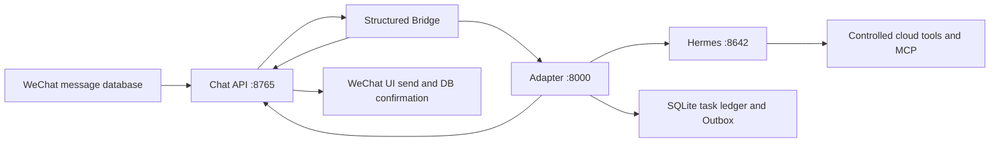

# WeChat Hermes Agent

把 Linux 微信群聊接入 Hermes Agent 的生产级适配层。入站消息来自微信数据库的结构化记录和 XML 元数据，不依赖截图或 OCR 判断发送者、群 ID、`@` 和引用关系。

该仓库由一套实际运行的云端系统整理而来，重点解决群聊 Agent 最容易出错的部分：可信身份、重复消息、停止竞态、异步任务、工具证据、媒体幂等和服务恢复。

## 核心能力

- 结构化消息入口：按 `room_id`、`sender_id`、`local_id` 和 `msg_svr_id` 建立可信消息身份。
- 房间白名单：配置群内成员权限相同，生产工具不对未知群开放。
- 同步与异步路由：代码保留普通问答和生产任务链路；当前云端发布将 `HERMES_WECHAT_CHAT_ONLY=true`，所有消息只走 Hermes Session 文字聊天，不启动搜索、文件、终端、浏览器、媒体或异步任务。
- 常态群聊：指定群的结构化文字消息会进入本地低信号过滤与房间级节流；被真实 `@`、回复机器人或直接叫“小格”时优先处理，其余消息由模型决定是否自然插话。未点名消息永远不创建任务。
- 本地控制命令：`任务`、`取消`、`重试`、`补充`、`修改`、`停止` 和 `只要文字` 不等待模型处理。
- 停止栅栏：停止消息先提交到 Chat API，旧结果在 UI 提交前再次检查并被抑制。
- 逐项 Outbox：文字、图片、视频和文件分别持久化状态与幂等键；状态不确定的媒体不会自动重发。
- 完成门禁：模型结束生成不等于任务成功，Verifier 根据工具退出码、来源和 Artifact 元数据判定结果。
- Artifact 校验：限制任务目录、路径穿越、软链接、真实 MIME、扩展名、大小和 SHA-256。
- 记忆治理：按会话隔离稳定偏好和项目事实，支持过期、替换与遗忘。
- 受控工具：生产工具接口仍保留用于后续恢复；纯聊天发布会在 Adapter 路由层和 Hermes 会话层同时关闭这些能力。
- Sophia 人格与中文 Humanizer：固定引入公开的 `Sophia` 1.0.0 和 `humanizer-zh-next` 1.2.0。前者只加载 `Persona & Voice`，后者负责自然中文短句节奏；两者均为 Adapter 只读资源。
- 国内外检索：Bing HTML/RSS、Bing News 与搜狗、360、百度结果合并，按意图、主题覆盖、来源质量、时效和区域多样性重排；SearXNG 可选合并。
- 可观测性：`/health`、`/metrics`、结构化 ID 日志、清理状态和恢复门禁。

## 架构



所有 HTTP 服务默认只监听 `127.0.0.1`。Chat API 同时负责结构化读取、发送栅栏、微信 UI 提交和数据库确认；Adapter 负责权限、任务、证据、Artifact 与交付状态；Hermes 负责对话和真实工具执行。

更完整的状态机和信任边界见 [架构说明](docs/architecture.md)。

## 快速验证

本地模拟栈会启动假的 Hermes 和 Chat API，只验证 Adapter 全链路，不接触真实微信、群聊或生产数据库。需要 Python 3.10 或 3.11。

### Linux / macOS

```bash
python3 -m venv .venv
.venv/bin/python -m pip install -r adapter/requirements-dev.txt
.venv/bin/python adapter/scripts/live_fake_stack.py
```

### Windows PowerShell

```powershell
py -3.11 -m venv .venv
.\.venv\Scripts\python -m pip install -r adapter\requirements-dev.txt
.\.venv\Scripts\python adapter\scripts\live_fake_stack.py
```

成功时脚本输出 `"status": "ok"`，并验证连续三次结构化 `@`、有/无工具证据、停止顺序、媒体 `uncertain` 和重启后不重复发送。详见 [快速开始](docs/quickstart.md)。

## 群内命令

| 命令 | 行为 |
| --- | --- |
| `任务` / `任务 T-XXXXXXXX` | 当前纯聊天发布只提示任务功能关闭 |
| `取消 T-XXXXXXXX` | 仍可取消遗留任务并提交任务级栅栏 |
| `重试 T-XXXXXXXX` | 当前纯聊天发布不创建新执行代次 |
| `补充 T-XXXXXXXX ...` | 当前纯聊天发布不启动任务 |
| `修改 T-XXXXXXXX ...` | 当前纯聊天发布不启动任务 |
| `停止` / `别发了` | 在满足触发条件时停止本群旧任务与旧发送 |
| `不要图片` / `只要文字` | 只抑制旧媒体，保留允许返回的文字 |
| `记住 ...` / `忘记 ...` | 当前纯聊天发布不写入持久记忆 |
| `你记得我什么` / `忘掉我` | 在 `@` 小格或回复小格后查询或清除当前成员的关系档案 |
| `别撩我` / `可以撩我` / `正常点` | 在 `@` 小格或回复小格后调整当前成员的聊天边界 |

任务编号只能在所属群或私聊会话中访问。同一白名单群内的成员可以管理该群任务。
纯聊天模式下只有停止、取消和媒体抑制这类控制指令保留；普通执行型话术会作为文字问题交给模型。

## 仓库结构

| 目录 | 内容 |
| --- | --- |
| `adapter/` | FastAPI Adapter、SQLite 状态机、Outbox、Verifier 和 MCP 工具 |
| `chat-api/` | 微信数据库结构化读取、发送控制、Bridge 和 systemd 单元 |
| `web-research/` | Hermes 搜索插件、SearXNG 配置、候选发布与回滚脚本 |
| `docs/` | 架构、快速开始和生产部署说明 |

生产配置显式禁用 Hermes 的动态 `skills` 工具集；固定版本的 `Sophia` 与 `humanizer-zh-next` 作为 Adapter 只读资源加载，不获得工具、网络、文件或微信发送能力。Sophia 只加载 `Persona & Voice`，不会加载语音、主动发送、wife mode、todo、Telegram 唤醒或原生 memory 章节。当前发布使用纯聊天模式，生产工具和任务队列保留在代码中但不会被消息路由触发。旧数据库中的 Skill 注册表和快照字段仅作为升级兼容数据保留，不参与当前聊天会话。

### 人格模式

| 信号 | 行为 |
| --- | --- |
| 默认 | 跟着用户长度接话；短话可以一句，普通聊天自然写 1 至 4 句、最多 320 字，不机械压成一句 |
| 常态监听 | 忽略纯表情、`哈哈`、`666` 等低信号消息；普通聊天至少间隔 12 秒和 2 个群消息，模型可用 `[[NO_REPLY]]` 保持安静；直接叫“小格”不受该节流限制 |
| 当前云端模式 | 只根据当前对话回复文字；执行型话题给判断或说明，不创建任务、不调用工具 |
| `锐评` / `吐槽` / `阴阳一下` / `贴吧老哥模式` | 先分析事实与逻辑，再输出克制的锐评 |
| `正常点` / `认真点` / `退出老哥模式` | 立即恢复默认口吻 |
| `别撩我` / `可以撩我` | 在结构化 `@` 或回复触发后，分别关闭或允许当前成员的轻暧昧语气 |
| 停止、取消、不要图片、只要文字 | 使用标准控制回复，不玩梗 |

人格规则由 [`persona.py`](adapter/app/persona.py) 从随版本发布的 [`Sophia`](adapter/skills/sophia/SKILL.md) 和 [`humanizer-zh-next`](adapter/skills/humanizer-zh-next/SKILL.md) 加载。Sophia 固定到 `f2cd448553d61aa3c2ea774dc7e2296f09d4b584`，只抽取 `Persona & Voice`；两个资源的来源、提交和 SHA-256 均锁定在各自 `SOURCE.lock.json`。Adapter 为每个 `(room_id, sender_id)` 保存独立关系档案，最多八条稳定偏好或共同梗，默认 90 天过期；摘要只在空闲时运行，同一成员在摘要开始前的新信号会合并为最多四轮内存片段，重启时仍会丢弃未持久化正文的摘要作业。人格和档案只影响措辞，不参与可信身份、任务状态、工具证据、停止栅栏或 Outbox 判定。

## 生产部署

生产链路依赖现有 Linux 微信桌面进程、可读取的消息数据库及密钥、Hermes Agent 运行时和 systemd。`adapter/deploy/install_cloud.sh` 是面向既有部署的原地迁移工具，包含固定 Ubuntu 路径、受保护文件哈希/inode 检查和旧服务回滚前提，不是新机器一键安装器。

开始前至少要准备：

1. `chat-api/config.json`：从 `chat-api/config.example.json` 创建，填入数据库、密钥文件、群 ID、机器人 wxid 和窗口参数。
2. `chat-api/db-config.json`：从 `chat-api/db-config.example.json` 创建。
3. `/etc/wechat-hermes/adapter.env`、`hermes.env`、`chat-api.env`、`bridge.env`：使用四个独立随机令牌，权限设为 `0600`。
4. `ALLOWED_WECHAT_ROOM_IDS`：只列出明确开放完整 Agent 能力的群。
5. 独立端口模拟测试、受保护文件基线和不重启微信的回滚步骤。

当前聊天发布使用 `HERMES_WECHAT_CHAT_ONLY=true`，模型目标为 `gpt-5.4-mini`。`HERMES_WECHAT_GROUP_LISTENER_ENABLED=true` 必须同时写入 Bridge 和 Adapter 环境，才会让小格常态参与已白名单群的结构化文字聊天；可用 `HERMES_WECHAT_GROUP_LISTENER_MIN_REPLY_GAP_SECONDS`、`HERMES_WECHAT_GROUP_LISTENER_MIN_TURNS_BETWEEN_REPLIES` 和 `HERMES_WECHAT_GROUP_LISTENER_NAMES` 调整节奏。模型凭据只通过服务器上的私有环境文件和轮换脚本写入，不放进仓库或日志。

完整前置条件、配置表、搜索候选构建、切换和回滚流程见 [生产部署](docs/production-deployment.md)。人格发布可用 `rollback_persona.sh PREVIOUS_RELEASE_ID` 切回上一版 Adapter，它会将会话 generation 提升到 `9` 并停止关系档案注入，但保留档案和发送状态。

仓库同时提供可选的 [`sshd-wechat-hermes.conf`](adapter/deploy/sshd-wechat-hermes.conf)。它只保留 `ubuntu` 公钥登录，并收紧未认证连接的占用时间和并发上限；应用前必须先用第二个全新 SSH 会话验证生产密钥，避免把管理入口锁死。

## 默认资源限制

| 限制 | 默认值 |
| --- | ---: |
| 全局 Hermes 并发 | 1 |
| 单任务时长 | 30 分钟 |
| 单任务执行代次 | 3 |
| 工具调用 | 80 次 |
| Artifact 数量 | 10 |
| Artifact 总量 | 500 MB |
| 单日估算费用 | 20 USD |
| Artifact 保留 | 7 天 |
| 任务与审计记录保留 | 30 天 |

这些值可在 `adapter/deploy/adapter.env.example` 中调整。

## 测试

```bash
python -m pip install -r requirements-ci.txt

cd adapter && python -m pytest -q
cd ../chat-api && python -m pytest -q
cd ../web-research && python -m pytest -q
```

测试使用临时数据库、假 Hermes 和假发送端，不向真实群发送内容。CI 还运行模拟全链路、Shell 语法和密钥扫描。

## 安全与隐私

- 仓库不应提交 `.env`、`config.json`、数据库、消息快照、日志、Artifact、浏览器资料、密钥文件或生产状态。
- Bridge 元数据属于可信输入，用户正文中的伪造 JSON/XML 字段不会覆盖身份。
- Hermes Worker 使用独立非 root 用户，systemd 限制可写路径并屏蔽微信状态、SSH 密钥、Docker Socket 和云元数据地址。
- Adapter 数据库会保存任务提示和结果以支持恢复；默认终态任务在 30 天后清理。部署前应阅读 [隐私说明](PRIVACY.md) 和 [安全策略](SECURITY.md)。

## 已知限制

- 微信数据库格式、加密方式和桌面 UI 坐标会随客户端版本变化，需要在升级微信前重新验收。
- 发送仍通过本机微信 UI 完成，数据库用于确认，Chat API 不是微信官方协议接口。
- 全局并发固定为 1，长任务会形成队列。
- 模型供应商仍可能成为单点；费用统计使用配置费率估算。
- 定时任务协议已预留，通用调度器尚未纳入本仓库。
- 生产安装器针对既有 Ubuntu 目录布局，新部署需要按实际环境适配路径和服务账户。

## 参与贡献

提交前请运行三组测试和模拟栈，并确认改动未包含真实群 ID、wxid、IP、令牌、消息正文或运行状态。参见 [CONTRIBUTING.md](CONTRIBUTING.md)。

## 许可证与声明

本项目采用 [Apache License 2.0](LICENSE)。微信/WeChat 与 Hermes Agent 是各自权利人的商标或项目；本仓库与其官方团队没有隶属关系。
