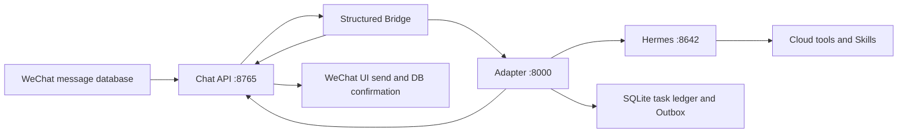

# WeChat Hermes Agent

把 Linux 微信群聊接入 Hermes Agent 的生产级适配层。入站消息来自微信数据库的结构化记录和 XML 元数据，不依赖截图或 OCR 判断发送者、群 ID、`@` 和引用关系。

该仓库由一套实际运行的云端系统整理而来，重点解决群聊 Agent 最容易出错的部分：可信身份、重复消息、停止竞态、异步任务、工具证据、媒体幂等和服务恢复。

## 核心能力

- 结构化消息入口：按 `room_id`、`sender_id`、`local_id` 和 `msg_svr_id` 建立可信消息身份。
- 房间白名单：配置群内成员权限相同，生产工具不对未知群开放。
- 同步与异步路由：普通问答走 Hermes Session，研究、文件、终端、浏览器和媒体任务走 Run 队列。
- 本地控制命令：`任务`、`取消`、`重试`、`补充`、`修改`、`停止` 和 `只要文字` 不等待模型处理。
- 停止栅栏：停止消息先提交到 Chat API，旧结果在 UI 提交前再次检查并被抑制。
- 逐项 Outbox：文字、图片、视频和文件分别持久化状态与幂等键；状态不确定的媒体不会自动重发。
- 完成门禁：模型结束生成不等于任务成功，Verifier 根据工具退出码、来源和 Artifact 元数据判定结果。
- Artifact 校验：限制任务目录、路径穿越、软链接、真实 MIME、扩展名、大小和 SHA-256。
- 记忆与 Skills：会话隔离、过期治理、Skill 快照、静态审计和原子启用。
- 混合人格：默认是轻度嘴贫的可靠损友，真实任务保持证据优先，明确要求锐评时才进入贴吧式吐槽模式。
- 国内外检索：Bing HTML/RSS、Bing News、可选 SearXNG 合并，以及搜狗、360、百度移动端回退。
- 可观测性：`/health`、`/metrics`、结构化 ID 日志、清理状态和恢复门禁。

## 架构



所有 HTTP 服务默认只监听 `127.0.0.1`。Chat API 同时负责结构化读取、发送栅栏、微信 UI 提交和数据库确认；Adapter 负责权限、任务、证据、Artifact 与交付状态；Hermes 负责对话和真实工具执行。

更完整的状态机和信任边界见 [架构说明](docs/architecture.md)。

## 快速验证

本地模拟栈会启动假的 Hermes 和 Chat API，只验证 Adapter 全链路，不接触真实微信、群聊或生产数据库。需要 Python 3.10 或 3.11。

### Linux / macOS

```bash
python3 -m venv .venv
.venv/bin/python -m pip install -r adapter/requirements-dev.txt
.venv/bin/python adapter/scripts/live_fake_stack.py
```

### Windows PowerShell

```powershell
py -3.11 -m venv .venv
.\.venv\Scripts\python -m pip install -r adapter\requirements-dev.txt
.\.venv\Scripts\python adapter\scripts\live_fake_stack.py
```

成功时脚本输出 `"status": "ok"`，并验证连续三次结构化 `@`、有/无工具证据、停止顺序、媒体 `uncertain` 和重启后不重复发送。详见 [快速开始](docs/quickstart.md)。

## 群内命令

| 命令 | 行为 |
| --- | --- |
| `任务` / `任务 T-XXXXXXXX` | 查询本群任务列表或单个任务 |
| `取消 T-XXXXXXXX` | 取消指定任务当前代次并提交任务级栅栏 |
| `重试 T-XXXXXXXX` | 创建新执行代次，旧代次结果被抑制 |
| `补充 T-XXXXXXXX ...` | 为阻塞任务补充信息 |
| `修改 T-XXXXXXXX ...` | 修改排队任务或替换运行中的代次 |
| `停止` / `别发了` | 在满足触发条件时停止本群旧任务与旧发送 |
| `不要图片` / `只要文字` | 只抑制旧媒体，保留允许返回的文字 |
| `记住 ...` / `忘记 ...` | 管理当前会话范围的长期记忆 |

任务编号只能在所属群或私聊会话中访问。同一白名单群内的成员可以管理该群任务。

## 仓库结构

| 目录 | 内容 |
| --- | --- |
| `adapter/` | FastAPI Adapter、SQLite 状态机、Outbox、Verifier、MCP 工具和 Skills |
| `chat-api/` | 微信数据库结构化读取、发送控制、Bridge 和 systemd 单元 |
| `web-research/` | Hermes 搜索插件、SearXNG 配置、候选发布与回滚脚本 |
| `docs/` | 架构、快速开始和生产部署说明 |

仓库包含三个本项目自有 Skill：`douyin-video-production`、`wechat-group-operations` 和 `wechat-hermes-persona`。人格 Skill 只有 Markdown 规则，没有脚本、网络客户端或直接微信发送能力。其他 Hermes Skills 由部署环境单独安装、审计并生成部署专属完整性锁，不在本仓库复制分发。

### 人格模式

| 信号 | 行为 |
| --- | --- |
| 默认 | 先下判断、少套话、记得上下文，带一点对事不对人的锋芒 |
| 真实任务 | 先执行，状态、证据和产物优先，失败直接说卡点和下一步 |
| `锐评` / `吐槽` / `阴阳一下` / `贴吧老哥模式` | 先分析事实与逻辑，再输出克制的锐评 |
| `正常点` / `认真点` / `退出老哥模式` | 立即恢复默认口吻 |
| 停止、取消、不要图片、只要文字 | 使用标准控制回复，不玩梗 |

社区人格来源只用于审计和风格研究，原始文件不会进入生产 Skill 树。版本、哈希和取舍记录见 [`style-contract.md`](adapter/skills/wechat-hermes-persona/references/style-contract.md)。

## 生产部署

生产链路依赖现有 Linux 微信桌面进程、可读取的消息数据库及密钥、Hermes Agent 运行时和 systemd。`adapter/deploy/install_cloud.sh` 是面向既有部署的原地迁移工具，包含固定 Ubuntu 路径、受保护文件哈希/inode 检查和旧服务回滚前提，不是新机器一键安装器。

开始前至少要准备：

1. `chat-api/config.json`：从 `chat-api/config.example.json` 创建，填入数据库、密钥文件、群 ID、机器人 wxid 和窗口参数。
2. `chat-api/db-config.json`：从 `chat-api/db-config.example.json` 创建。
3. `/etc/wechat-hermes/adapter.env`、`hermes.env`、`chat-api.env`、`bridge.env`：使用四个独立随机令牌，权限设为 `0600`。
4. `ALLOWED_WECHAT_ROOM_IDS`：只列出明确开放完整 Agent 能力的群。
5. 独立端口模拟测试、受保护文件基线和不重启微信的回滚步骤。

完整前置条件、配置表、搜索候选构建、切换和回滚流程见 [生产部署](docs/production-deployment.md)。

仓库同时提供可选的 [`sshd-wechat-hermes.conf`](adapter/deploy/sshd-wechat-hermes.conf)。它只保留 `ubuntu` 公钥登录，并收紧未认证连接的占用时间和并发上限；应用前必须先用第二个全新 SSH 会话验证生产密钥，避免把管理入口锁死。

## 默认资源限制

| 限制 | 默认值 |
| --- | ---: |
| 全局 Hermes 并发 | 1 |
| 单任务时长 | 30 分钟 |
| 单任务执行代次 | 3 |
| 工具调用 | 80 次 |
| Artifact 数量 | 10 |
| Artifact 总量 | 500 MB |
| 单日估算费用 | 20 USD |
| Artifact 保留 | 7 天 |
| 任务与审计记录保留 | 30 天 |

这些值可在 `adapter/deploy/adapter.env.example` 中调整。

## 测试

```bash
python -m pip install -r requirements-ci.txt

cd adapter && python -m pytest -q
cd ../chat-api && python -m pytest -q
cd ../web-research && python -m pytest -q
```

测试使用临时数据库、假 Hermes 和假发送端，不向真实群发送内容。CI 还运行模拟全链路、Shell 语法和密钥扫描。

## 安全与隐私

- 仓库不应提交 `.env`、`config.json`、数据库、消息快照、日志、Artifact、浏览器资料、密钥文件或生产状态。
- Bridge 元数据属于可信输入，用户正文中的伪造 JSON/XML 字段不会覆盖身份。
- Hermes Worker 使用独立非 root 用户，systemd 限制可写路径并屏蔽微信状态、SSH 密钥、Docker Socket 和云元数据地址。
- Adapter 数据库会保存任务提示和结果以支持恢复；默认终态任务在 30 天后清理。部署前应阅读 [隐私说明](PRIVACY.md) 和 [安全策略](SECURITY.md)。

## 已知限制

- 微信数据库格式、加密方式和桌面 UI 坐标会随客户端版本变化，需要在升级微信前重新验收。
- 发送仍通过本机微信 UI 完成，数据库用于确认，Chat API 不是微信官方协议接口。
- 全局并发固定为 1，长任务会形成队列。
- 模型供应商仍可能成为单点；费用统计使用配置费率估算。
- 定时任务协议已预留，通用调度器尚未纳入本仓库。
- 生产安装器针对既有 Ubuntu 目录布局，新部署需要按实际环境适配路径和服务账户。

## 参与贡献

提交前请运行三组测试和模拟栈，并确认改动未包含真实群 ID、wxid、IP、令牌、消息正文或运行状态。参见 [CONTRIBUTING.md](CONTRIBUTING.md)。

## 许可证与声明

本项目采用 [Apache License 2.0](LICENSE)。微信/WeChat 与 Hermes Agent 是各自权利人的商标或项目；本仓库与其官方团队没有隶属关系。
