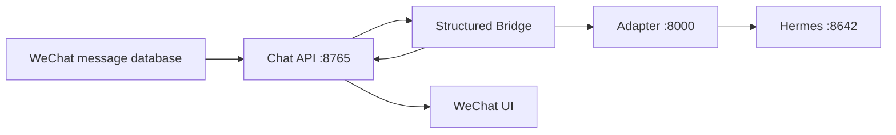

# WeChat Hermes Agent

把 Linux 微信群聊接入 Hermes 的结构化纯聊天适配层。入站消息来自微信数据库记录和 XML 元数据，发送者、群 ID、原生 `@`、引用关系与消息 ID 均不依赖截图或 OCR。

当前发布目标是让群里的“小格”稳定参与聊天。它使用固定版本的孙笑川运行时组合包作为唯一人格来源，群内显示名称仍为“小格”。

## 当前运行契约

- 链路固定为 `Chat API :8765 -> db_bridge.py -> Adapter :8000 -> Hermes`，服务只监听服务器回环地址。
- Chat API 为每条消息输出统一的 `room_id`、`sender_id`、`source_local_id`、`msg_svr_id`、`is_bot`、`is_self`、原生 `@` 与引用字段。
- Bridge 统一规范化字段别名、Unicode、大小写和数字 ID；去重优先使用 `room_id + msg_svr_id`，再使用 `room_id + local_id`。旧内容指纹仅用于滚动升级兼容。
- 自发消息、机器人身份记录和伪装为入站的记录不会触发聊天，也不会进入群聊上下文。
- 每个群保存最近 24 小时、最多 120 条时间线；每轮只给模型最近 16 条自然格式的 `昵称：内容` 记录与当前可信消息。
- 模型会话系统提示包含“小格”名称协议、孙笑川章节、共享流行语库和单人聊天规则。角色卡、关系档案、群摘要、服务 JSON 与其他人物章节保持在运行时之外。
- 每轮聊天前后都会清理 Adapter 自有 Hermes Session，避免服务端持久历史绕过 16 条时间线边界。
- 所有 Hermes 聊天请求使用 `disable_tools=true`。搜索、终端、文件、浏览器、异步作业、媒体自动交付和主动私聊均未启用。
- 常态监听由本地低信号过滤、去重和房间级节流控制。真实 `@`、回复小格、或直接叫“小格”会优先进入对话。
- 停止栅栏、消息节流、入站账本和发送状态仍保留。旧任务与旧 Outbox 在启动时隔离，历史任务查询保持只读。



## 固定人格资源

运行时只加载来自 [WeirdoTV-Skill](https://github.com/BeamusWayne/WeirdoTV-Skill) 固定提交的孙笑川相关组合资源：

| 项目 | 值 |
| --- | --- |
| 提交 | `1635aceebf4e84b32db37ccd00244ca0dcc04574` |
| 运行时资源 | `adapter/personas/sunxiaochuan.runtime.md` |
| 组合内容 | 孙笑川章节、Slang Corpus、单人规则（适配）、小格群聊表达规则 |
| 孙笑川章节 | `### 😂 孙笑川 Sun Xiaochuan` |
| 章节 SHA-256 | `b1fa3a4d08206c0210edd527dd2ef30e5ef36bd4eec7401881de873aa75fa922` |
| 运行时资源 SHA-256 | `2b2afb064903f2822ebe179c2f62baccd0a94ea02b895b78208795cc22db13f8` |
| 上游 `SKILL.md` SHA-256 | `471af1edc7cf88f89549b9ff3d17952810d7e55eaafb647ac21584be96801305` |
| 许可证 | MIT，归档并校验 SHA-256 |
| 人格版本 | `weirdotv@1.0.0+sunxiaochuan@3.0.0` |

组合资源位于 [`adapter/personas/sunxiaochuan.runtime.md`](adapter/personas/sunxiaochuan.runtime.md)，组件来源锁位于 [`adapter/personas/RUNTIME.lock.json`](adapter/personas/RUNTIME.lock.json)，原始章节仍保存在 [`adapter/personas/sunxiaochuan.section.md`](adapter/personas/sunxiaochuan.section.md)。校验失败时 Adapter 进入 `degraded`，暂停人格会话加载。

## 配置

从 [`adapter/deploy/adapter.env.example`](adapter/deploy/adapter.env.example) 和 `chat-api/*.example` 创建服务器私有环境文件。四个令牌保持不同值，环境文件权限设为 `0600`。

关键项：

```text
ALLOWED_WECHAT_ROOM_IDS=ROOM_ID
WECHAT_BOT_WXID=BOT_WXID
HERMES_WECHAT_CHAT_ONLY=true
HERMES_WECHAT_GROUP_LISTENER_ENABLED=true
HERMES_WECHAT_GROUP_LISTENER_MIN_REPLY_GAP_SECONDS=12
HERMES_WECHAT_GROUP_LISTENER_MIN_TURNS_BETWEEN_REPLIES=3
HERMES_WECHAT_GROUP_LISTENER_NAMES=小格,Hermes
HERMES_WECHAT_SESSION_GENERATION=16
```

`ALLOWED_WECHAT_ROOM_IDS` 仅列出明确开放的小群。群外消息和未授权私聊不会进入生产聊天会话。

## 本地验证

需要 Python 3.10 或 3.11。

```bash
python -m pip install -r requirements-ci.txt

cd adapter
python -m pytest -q

cd ../chat-api
python -m pytest -q

cd ..
python adapter/scripts/live_fake_stack.py
```

测试仅使用临时数据库、假 Hermes 与假发送端，不会向真实群发送测试内容。

## 部署与回滚

- 生产发布使用 [`adapter/deploy/install_cloud.sh`](adapter/deploy/install_cloud.sh) 或 [`adapter/deploy/deploy_ccv3_adapter_release.sh`](adapter/deploy/deploy_ccv3_adapter_release.sh)。脚本名称为历史兼容，发布内容是孙笑川单人格纯聊天版本。
- 发布前记录微信 PID、服务状态和 `db-state*`、`send-state*`、`bot.db` 的 inode 与哈希。
- 发布只重启 Adapter 与必要 Hermes 组件，不重启微信，不改动上述状态文件。
- 回滚使用 [`adapter/deploy/rollback_persona.sh`](adapter/deploy/rollback_persona.sh)，会提升会话代次并保留 SQLite、游标与发送状态。

完整步骤见 [生产部署](docs/production-deployment.md) 和 [架构说明](docs/architecture.md)。

## 隐私

仓库不应包含 `.env`、`config.json`、数据库快照、日志、真实群 ID、wxid、令牌、消息正文或生产状态文件。Adapter 日志记录 ID、状态、耗时和错误类型，避免记录消息正文与密钥。参见 [PRIVACY.md](PRIVACY.md) 和 [SECURITY.md](SECURITY.md)。

## 许可证

本项目采用 [Apache License 2.0](LICENSE)。固定人格来源保留其 MIT 许可证与署名。
