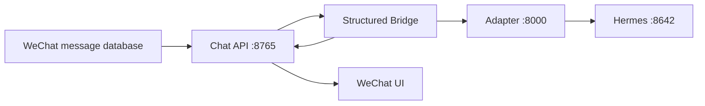

# WeChat Hermes Agent

把 Linux 微信群聊接入 Hermes 的结构化纯聊天适配层。入站消息来自微信数据库记录和 XML 元数据，发送者、群 ID、原生 `@`、引用关系与消息 ID 均不依赖截图或 OCR。

当前发布目标是让群里的“小格”稳定参与聊天。正常回复使用服务器本地聊天记忆库导出的“小格最佳人设”，群内显示名称仍为“小格”；固定孙笑川运行时组合包仅在记忆服务冷启动或暂时不可用时作为兜底。

## 当前运行契约

- 链路固定为 `Chat API :8765 -> db_bridge.py -> Adapter :8000 -> Hermes`，服务只监听服务器回环地址。
- Chat API 为每条消息输出统一的 `room_id`、`sender_id`、`source_local_id`、`msg_svr_id`、`is_bot`、`is_self`、原生 `@` 与引用字段。
- Bridge 统一规范化字段别名、Unicode、大小写和数字 ID；去重优先使用 `room_id + msg_svr_id`，再使用 `room_id + local_id`。旧内容指纹仅用于滚动升级兼容。
- 自发消息、机器人身份记录和伪装为入站的记录不会触发聊天，也不会进入群聊上下文。
- 每个群保存最近 24 小时、最多 120 条时间线；每轮只给模型最近 16 条自然格式的 `昵称：内容` 记录与当前可信消息。
- Adapter 每 5 分钟从同机 `wx-chat-memory` 的认证回环接口读取一次最佳人设快照；快照只影响用词、节奏和接梗方式，永远不能改变群身份、工具关闭、发送链路或系统协议。
- 每轮会话保留“小格”名称协议和群聊规则；当前最佳人设随回合注入。角色卡、关系档案、群摘要、服务 JSON 与其他人物章节保持在运行时之外。
- 每轮聊天前后都会清理 Adapter 自有 Hermes Session，避免服务端持久历史绕过 16 条时间线边界。
- 所有 Hermes 聊天请求使用 `disable_tools=true`。搜索、终端、文件、浏览器、异步作业、媒体自动交付和主动私聊均未启用。
- 常态监听会优先接问题、邀约、经历分享与当前对话伙伴的续句。普通聊天每两条有内容的消息可接一次；正常间隔 6 秒，正在聊天的同一成员续句可缩短至 2 秒。它能承接另一位群友近期未回答的问题，沿用可信昵称接话，不会自动发原生 `@` 通知。
- 自动插话每群每 10 分钟最多尝试 8 次，计数跨重启保留；真实 `@`、回复小格、或直接叫“小格”会优先进入对话。群里安静时不会凭空发送新消息。
- 小格刚参与聊天后，裸“停止”也会落发送栅栏并暂停自动插话 10 分钟；期间明确叫名和 `@` 仍可回应。Luna 的群聊超时为 25 秒。
- 停止栅栏、消息节流、入站账本和发送状态仍保留。旧任务与旧 Outbox 在启动时隔离，历史任务查询保持只读。


```mermaid
flowchart LR
    DB[WeChat message database] --> API[Chat API :8765]
    API --> BRIDGE[Structured Bridge]
    BRIDGE --> ADAPTER[Adapter :8000]
    ADAPTER --> HERMES[Hermes :8642]
    BRIDGE --> API
    API --> WXUI[WeChat UI]
```

## 人格来源与兜底

正常运行时加载 `wx-chat-memory` 的最佳人设快照。该服务只监听 `127.0.0.1:8790`，Adapter 通过 root 私有令牌读取导出内容，并限制长度、去除控制字符与指令型行。导出服务短暂异常时继续使用最后一个有效快照；没有任何有效快照时才加载来自 [WeirdoTV-Skill](https://github.com/BeamusWayne/WeirdoTV-Skill) 固定提交的孙笑川相关组合资源：

| 项目 | 值 |
| --- | --- |
| 提交 | `1635aceebf4e84b32db37ccd00244ca0dcc04574` |
| 运行时资源 | `adapter/personas/sunxiaochuan.runtime.md` |
| 组合内容 | 孙笑川章节、Slang Corpus、单人规则（适配）、小格群聊表达规则 |
| 孙笑川章节 | `### 😂 孙笑川 Sun Xiaochuan` |
| 章节 SHA-256 | `b1fa3a4d08206c0210edd527dd2ef30e5ef36bd4eec7401881de873aa75fa922` |
| 运行时资源 SHA-256 | `2b2afb064903f2822ebe179c2f62baccd0a94ea02b895b78208795cc22db13f8` |
| 上游 `SKILL.md` SHA-256 | `471af1edc7cf88f89549b9ff3d17952810d7e55eaafb647ac21584be96801305` |
| 许可证 | MIT，归档并校验 SHA-256 |
| 人格版本 | `weirdotv@1.0.0+sunxiaochuan@3.0.0` |

组合资源位于 [`adapter/personas/sunxiaochuan.runtime.md`](adapter/personas/sunxiaochuan.runtime.md)，组件来源锁位于 [`adapter/personas/RUNTIME.lock.json`](adapter/personas/RUNTIME.lock.json)，原始章节仍保存在 [`adapter/personas/sunxiaochuan.section.md`](adapter/personas/sunxiaochuan.section.md)。校验失败时 Adapter 进入 `degraded`，暂停人格会话加载。

## 配置

从 [`adapter/deploy/adapter.env.example`](adapter/deploy/adapter.env.example) 和 `chat-api/*.example` 创建服务器私有环境文件。四个令牌保持不同值，环境文件权限设为 `0600`。

关键项：

```text
ALLOWED_WECHAT_ROOM_IDS=ROOM_ID
WECHAT_BOT_WXID=BOT_WXID
HERMES_WECHAT_CHAT_ONLY=true
HERMES_WECHAT_GROUP_LISTENER_ENABLED=true
HERMES_WECHAT_GROUP_LISTENER_MIN_REPLY_GAP_SECONDS=6
HERMES_WECHAT_GROUP_LISTENER_MIN_TURNS_BETWEEN_REPLIES=2
HERMES_WECHAT_GROUP_PARTICIPATION_ENABLED=true
HERMES_WECHAT_GROUP_PARTICIPATION_LIMIT=8
HERMES_WECHAT_SYNC_TIMEOUT_SECONDS=25
HERMES_WECHAT_GROUP_LISTENER_NAMES=小格,Hermes
HERMES_WECHAT_SESSION_GENERATION=18
WXMEMORY_PERSONA_URL=http://127.0.0.1:8790
WXMEMORY_PERSONA_TOKEN=WXMEMORY_TOKEN
WXMEMORY_PERSONA_REFRESH_SECONDS=300
```

`ALLOWED_WECHAT_ROOM_IDS` 仅列出明确开放的小群。群外消息和未授权私聊不会进入生产聊天会话。

## 本地验证

需要 Python 3.10 或 3.11。

```bash
python -m pip install -r requirements-ci.txt

cd adapter
python -m pytest -q

cd ../chat-api
python -m pytest -q

cd ..
python adapter/scripts/live_fake_stack.py
```

测试仅使用临时数据库、假 Hermes 与假发送端，不会向真实群发送测试内容。

## 部署与回滚

- 生产发布使用 [`adapter/deploy/install_cloud.sh`](adapter/deploy/install_cloud.sh) 或 [`adapter/deploy/deploy_ccv3_adapter_release.sh`](adapter/deploy/deploy_ccv3_adapter_release.sh)。脚本名称为历史兼容，发布内容是孙笑川单人格纯聊天版本。
- 发布前记录微信 PID、服务状态和 `db-state*`、`send-state*`、`bot.db` 的 inode 与哈希。
- 发布只重启 Adapter 与必要 Hermes 组件，不重启微信，不改动上述状态文件。
- 回滚使用 [`adapter/deploy/rollback_persona.sh`](adapter/deploy/rollback_persona.sh)，会提升会话代次并保留 SQLite、游标与发送状态。

完整步骤见 [生产部署](docs/production-deployment.md) 和 [架构说明](docs/architecture.md)。

## 隐私

仓库不应包含 `.env`、`config.json`、数据库快照、日志、真实群 ID、wxid、令牌、消息正文或生产状态文件。Adapter 日志记录 ID、状态、耗时和错误类型，避免记录消息正文与密钥。参见 [PRIVACY.md](PRIVACY.md) 和 [SECURITY.md](SECURITY.md)。

## 许可证

本项目采用 [Apache License 2.0](LICENSE)。固定人格来源保留其 MIT 许可证与署名。
