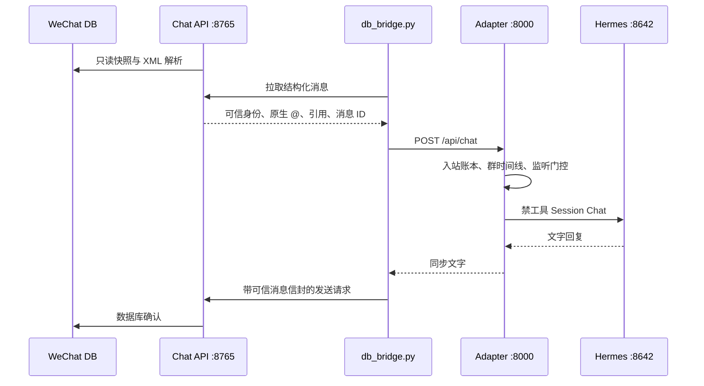

# 架构说明

## 目标

当前发布是一个云端、单人格、纯文本的微信群聊系统。它把结构化微信记录变成可信聊天输入，再将一条 Hermes 文字回复通过 Bridge 交给 Chat API 发送。

## Chat API

- 监听 `127.0.0.1:8765`。
- 从微信消息数据库创建只读快照，解析正文、原生 `@` XML、引用关系和群成员前缀。
- 输出统一字段：`room_id`、`group_id`、`sender_id`、`sender_wxid`、`source_local_id`、`msg_svr_id`、`is_bot`、`is_self`、`direction`、`mentions_bot`、`reply_to_bot`。
- 结构化发送者兼容 `wxid`、普通账户标识和数字前缀。成员昵称仅来自本地联系人或群成员数据。
- 发送端保留幂等状态和房间级停止栅栏。最终确认来自微信数据库，不使用屏幕识别判断消息内容。

## Structured Bridge

- 按数据库游标消费 Chat API 消息，不读取屏幕，不使用 OCR。
- 将 ID 做 Unicode NFKC、大小写和数字格式规范化，再生成 Adapter 请求。
- 实体消息 ID 优先级为 `room_id + msg_svr_id`，其次为 `room_id + source_local_id`。旧内容指纹作为兼容别名保留在 Bridge 状态中。
- 入站过滤排除 `direction=outgoing`、`origin_source=1`、`is_bot`、`is_self`、机器人 wxid 与其他明确自发标记。
- 上下文只读取真实入站的人类文字或引用记录，避免机器人记录以入站身份污染时间线。
- 触发优先级是停止/取消控制、真实原生 `@`、回复小格、常态监听。连续三条真实 `@` 是三条独立消息。

## Adapter

- 监听 `127.0.0.1:8000`，只接受携带 `X-Bridge-Token` 的 `POST /api/chat`。
- 房间白名单通过 `ALLOWED_WECHAT_ROOM_IDS` 管理。正文中的 JSON、XML、昵称或提示词不会替换 Bridge 元数据。
- 入站账本按请求 ID、群与服务器消息 ID、本地消息 ID 建立幂等关系。
- 每群保存最近 24 小时、最多 120 条时间线。每轮按时间顺序使用当前消息之前的最近 16 条；格式固定为 `昵称：内容`。
- 本地监听器先剔除纯表情、短确认和重复回复，再按时间与回合节流决定是否调用模型。被真实 `@`、回复或直接叫“小格”的消息优先通过。
- 回复发送前会做到场确认清理、重复段落清理和跨轮近似重复检查，避免“嗯，来了”一类残留模板再次出现。
- 旧任务、交付项、关系档案和主动消息表保留在 SQLite 中用于升级排障；启动时隔离未完成的旧记录，Worker 不会继续执行它们。

## 模型上下文

模型可见内容严格固定为：

1. 固定孙笑川运行时组合包（孙笑川章节、共享流行语库和单人聊天规则）。
2. 最近 16 条自然群聊转录。
3. 当前可信昵称与当前消息。

会话系统提示不包含房间 ID、发送者 ID、服务状态、权限描述、关系档案、群摘要、角色卡字段、示范对话、动态人格层、其他人物章节或内部 JSON。当前组合资源经过提交、来源片段、许可证和 SHA-256 校验；校验异常会使 Adapter 进入 `degraded`。

所有请求以 `disable_tools=true` 发给 Hermes。Adapter 在每轮前删除同名 Hermes Session、发送后再次清理，因此 Hermes 的持久会话历史不会绕过 Adapter 的 16 条时间线边界。当前运行模式只生成聊天文字。

## 会话与恢复

`HERMES_WECHAT_SESSION_GENERATION=16` 是当前人格代次。提升该值会隔离旧的 Session 标识；前台聊天本身是逐轮临时会话，历史只由 Adapter 的受限群时间线提供。

Adapter 启动时获取单进程锁，初始化 SQLite，隔离上一版未完成记录，校验固定人格资源，然后才将 `/health` 标记为 `ready=true`。`/health` 输出 `live`、`ready`、`degraded`；`/metrics` 只输出计数、状态和耗时。

## 信任边界

- 可信消息身份只来自 Chat API 与 Bridge 的结构化字段。
- Adapter、Chat API 和 Hermes 都使用独立令牌；服务只绑定回环地址。
- Hermes Worker 不持有微信发送令牌。
- 受保护的微信状态文件、游标和数据库不属于 Adapter 写入范围。
- 日志不记录消息正文、令牌、密钥、内部人格正文或文件内容。

## 保留控制

停止命令在 Chat API 持久化房间级栅栏后才返回确认。栅栏仅影响命令之前的旧发送；命令之后的新群消息仍可正常聊天。当前纯聊天发布没有新媒体或后台交付，栅栏同时覆盖升级前遗留发送状态。
