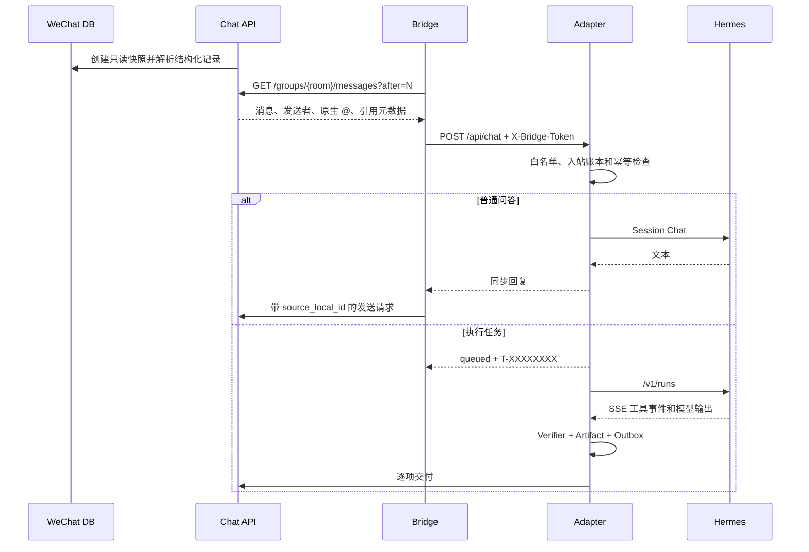

# 架构说明

## 目标

本系统把微信群消息转换为带可信身份的 Agent 请求，并把对话、真实执行和媒体交付拆成可恢复的状态机。核心原则是：接收侧使用结构化数据库记录，执行侧要求工具证据，发送侧使用栅栏和逐项 Outbox。

## 组件

### Chat API

- 监听 `127.0.0.1:8765`。
- 从微信消息数据库创建只读快照，解析消息、XML、原始发送者、原生 `@` 列表和引用关系。
- 对外提供拉取消息、SSE、文字/媒体发送、发送栅栏和发送状态查询。
- 发送前后查询微信数据库确认；媒体已进入 UI 提交但确认结果不明确时返回 `409 uncertain`。
- 栅栏最终检查和 Enter 提交位于同一房间临界区。

### Structured Bridge

- 按数据库游标读取 Chat API，不读取屏幕，不调用 OCR。
- 生成稳定的 `request_id`，并携带 `room_id`、`sender_id`、`source_local_id`、`msg_svr_id`、`mentions_bot` 和 `reply_to_bot`。
- 当 `chat_group_listener_enabled=true` 时，指定群中所有结构化有效的文字或引用消息都会转给 Adapter；控制命令仍优先，真实 `@` 与回复关系仍随消息携带。关闭时保持控制命令、结构化 `@`、引用机器人消息、忽略的旧触发顺序。
- 微信可能在正文落库后才补写原生 `@` XML；Bridge 对可见 mention 候选保留短暂稳定窗口，等可信元数据补齐后再判定。候选布尔值本身不参与授权或触发。
- 同步回复由 Bridge 发送；异步任务的最终交付由 Adapter Outbox 发送。

### Adapter

- 监听 `127.0.0.1:8000`，入口为 `POST /api/chat`。
- 使用 `X-Bridge-Token` 验证 Bridge，忽略正文中伪造的身份字段。
- 根据房间白名单决定工具权限，按群或私聊隔离 Session 和记忆。
- 普通问答走 Hermes Session Chat；显式搜索、时效事实和真假核实自动进入联网 Run，其他执行请求持久化后进入单并发 Run Worker。
- 当 `HERMES_WECHAT_CHAT_ONLY=true` 时，以上执行意图统一降级为禁工具的同步文字会话；已有生产 Run 会被取消，遗留 Outbox 会被抑制。
- `HERMES_WECHAT_GROUP_LISTENER_ENABLED=true` 时，未点名消息先经低信号过滤、房间级时间/回合节流和模型静默标记判定；它们只能走禁工具文字会话，绝不创建任务或进入 Outbox。真实 `@`、引用机器人和直接名称可更快进入对话，但仍不绕过可信身份链。
- Hermes 返回 `429/503` 等瞬时状态时，Adapter 按服务端 `Retry-After` 和有界指数退避重试，不连续撞击上游。
- 管理任务代次、SSE 工具事件、Verifier、Artifact、Outbox、费用和资源限制。
- 原生加载固定的 Character Card V3 安全文本子集：卡片、规范、许可证和来源锁均通过哈希校验；只支持 `{{char}}`、`{{user}}`、常量 Lorebook 和字面关键词匹配，忽略资产、代码、远程 URI、正则和高级装饰器。
- 每个群保存最近 24 小时、最多 120 条结构化文字记录；每轮提示只注入当前消息之前的最近 16 条。`room_companion_state` 保存气氛、群梗、未完话题和短摘要，最长保留 30 天；每四条有效消息或关键回复后创建可恢复的低优先级摘要作业，失败时保留上一版状态。
- 生产陪聊只使用 `(room_id)` 隔离的短期时间线和共享摘要；`sender_id` 仅用于可信身份、幂等和审计，不创建或注入成员级关系档案。
- 生产不运行成员定向主动消息。所有对外回复都由当前入站消息触发，并经过监听节流、重复过滤、停止栅栏和 Outbox；旧版本关系表和主动任务表只保留作数据库兼容，不再读取或写入。

### Hermes Worker

- 监听 `127.0.0.1:8642`。
- 负责对话生成、计划执行、终端、文件、浏览器和联网检索。
- Hermes 动态 `skills` 工具集在生产配置中禁用。Sophia 的 MIT `Persona & Voice` 原则已署名并整合到固定 CCV3 卡片；`humanizer-zh-next` 不进入运行时提示。卡片不具备工具调用、文件执行或微信发送能力。
- Worker 不持有 Bridge Token 或 Chat API Token，微信发送必须经过 Adapter/Bridge 的受控链路。
- systemd 将写权限限制到工作区和 Artifact 目录。

### Web Research Provider

- 作为 Hermes 后端插件注册 `web_search` 和 `web_extract`。
- 默认使用 Bing HTML/RSS 和 Bing News；中文查询在全球结果不足时使用固定国内 HTTPS 回退。
- SearXNG 只监听回环地址，默认不合并，显式启用后作为附加结果源。
- 页面提取在每次跳转后重新做 URL 安全检查，并限制 MIME、字节数和 URL 数量。

## 入站信任链



Adapter 入站账本对 `request_id`、`(room_id, source_local_id)` 和 `(room_id, msg_svr_id)` 建立约束。同一消息重复到达时返回原结果；同样文本但不同真实 local ID 会分别处理。

## 停止栅栏

收到停止消息 `N` 后，顺序固定为：

1. Adapter 调用 Chat API 提交房间级或任务级栅栏。
2. Chat API 持久化栅栏并返回确认。
3. Adapter 标记取消、抑制旧 Outbox 并停止 Hermes Run。
4. 停止确认使用 `N` 自身的消息身份发送。

房间栅栏只拦截 `source_local_id < N` 的旧结果，后续新消息仍可工作。`media_only` 栅栏仅拦截图片、视频和文件。任务级栅栏绑定 `task_id + generation`，不会影响同群其他任务。

## 任务状态

对外状态固定为：

```text
queued -> running -> succeeded
                  -> failed
                  -> canceled
```

内部 `blocked_on_input` 会释放 Worker，只询问一次补充信息；补充后回到队列。修改运行中或终态任务会增加 `generation`，旧代次的工具结果和发送项均被抑制。

## 完成门禁

执行计划保存目标、任务类型、能力、必要工具、成功条件、超时、工具上限和交付策略。Verifier 按任务类型检查：

| 任务 | 必要证据 |
| --- | --- |
| 命令 | 可信工具事件和退出码 `0` |
| 文件 | 已注册 Artifact、真实 MIME、大小和 SHA-256 |
| 研究 | 可信搜索/提取工具事件和结构化来源 URL |
| 浏览器 | 页面或操作结果证据 |
| 纯文本创作 | 模型输出即可 |

`run.completed` 只表示模型停止生成。外部动作缺少匹配证据时，任务进入失败或输入阻塞状态。

## Artifact 与 Outbox

模型输出中的 `MEDIA:/path` 会被删除并记录，不触发发送。文件必须由受控工具调用 `wechat_register_artifact` 注册，且位于 `ARTIFACT_ROOT/T-XXXXXXXX/`。

Outbox 每个项目使用以下状态：

```text
prepared -> sending -> confirmed
                    -> uncertain
                    -> suppressed
                    -> failed
```

确定性幂等键包含任务、代次和项目序号。文字在确认未提交时最多重试三次；媒体处于 `sending`、HTTP `409` 或确认不清楚时转为 `uncertain`，重启后保持原状态。用户显式重试会创建新代次和新幂等键。

默认交付策略为 `text_only`。只有用户明确要求媒体，或任务本身明确要求对应产物时，最多交付三个主 Artifact；中间截图、缓存和调试文件不会自动发送。

## 数据存储

| 存储 | 主要内容 | 默认保留 |
| --- | --- | --- |
| Adapter SQLite | 入站账本、任务提示/输出、工具事件、Artifact、Outbox、用量、项目记忆、24 小时群时间线、30 天房间摘要和不含正文的房间监听节流状态；旧关系表仅作兼容保留 | 终态任务与审计 30 天；群摘要 30 天 |
| Artifact 目录 | 任务生成的已注册文件 | 7 天 |
| Outbound control SQLite | 房间/任务发送栅栏 | 运行状态数据 |
| Chat API cache | 数据库快照、发送状态和临时媒体 | 由 Chat API 管理 |
| Web cache SQLite | 查询哈希、结果和过期信息，不保存查询正文 | 按 TTL/容量 |

## 恢复与健康

Adapter 启动时先获取单进程锁，恢复未完成任务并对账 Outbox，恢复结束前 `ready=false`。房间摘要仅重放本地 24 小时时间线，因此可将 `running` 作业恢复为 `queued`；生产启动不会恢复或执行旧关系摘要、成员主动消息或成员关系表中的内容。`/health` 区分 `live`、`ready` 和 `degraded`；定时清理失败、状态文件过期、Worker 退出或角色卡完整性异常会进入 degraded。`/metrics` 只输出计数、状态和耗时，不包含消息正文。

## 安全边界

- 可信身份只来自 Bridge 认证后的结构化字段。
- 工具权限只授予 `ALLOWED_WECHAT_ROOM_IDS` 中的群。
- 内部 API 使用独立 Token；Hermes Worker 不获取微信发送凭据。
- 网络工具阻止回环、私网、链路本地、云元数据和重定向 SSRF。
- 文件工具限制根目录、软链接、归档条目数和下载字节数。
- Hermes 的动态 `skills` 工具集被显式禁用，Adapter 只加载锁定的 CCV3 规范、`xiaoge.card.json` 和 Sophia 署名归档，不暴露动态安装或 reload 接口。
- 角色卡只参与会话表达、Lorebook 和示范对话，不参与可信身份、任务状态、工具证据、停止栅栏或 Outbox 判定；主动开场功能在生产关闭。
- 升级不会删除旧 SQLite 中的 Skill 历史字段或注册表；这些兼容数据没有运行时读取路径。
